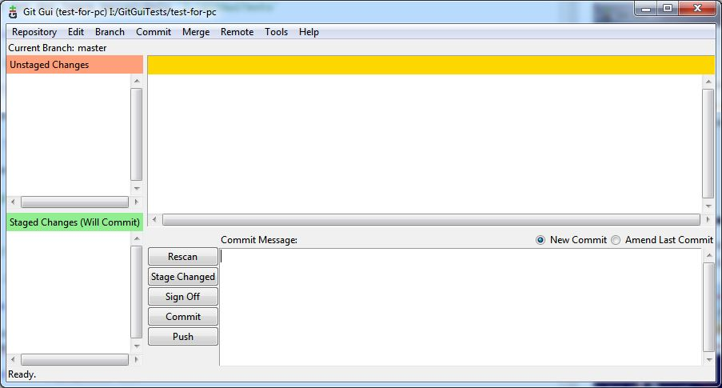
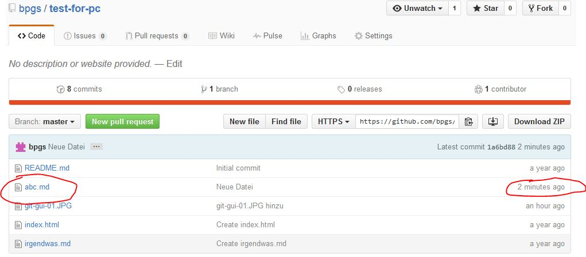

# Arbeiten mit Git

## Anmerkung: 

Der Inhalt dieser Datei wurde nach README.md kopiert

## Vorbereitung

Meine Github-Projekte sind erreichbar über [https://github.com/bpgs](https://github.com/bpgs "Meine Github-Startseite"). Sieht so aus:

Nach Click auf **Repositories** sieht man

Die **Public Profile** Seite, die man nach Klick auf **Edit profile** sieht, sieht so aus

Hier findet man auch die Unterseite SSH-Keys. Sie hat sich gegenüber dem Screenshot vom 19.09.2014 (siehe unten) stark verändert:

Sobald man einen Key mit Approve bestätigt, verschwindet er in dieser Übersicht. Diese Bestätigung kann man unter Security -> Security history nachvollziehen.

## Test Repository
 
Im Github-Account wurde die Test Repository **test-for-pc** erstellt

## Auf 1Blue

Hier kann man nicht mit Git arbeiten. Ist nicht installiert.

## Auf One.com

Git ist installiert

ssh-keygen ist nicht installiert. Es lässt sich also kein SSH Key erzeugen.

## Auf Proplay

***Achtung***, das Aussehen und die Funktionalität der mit den Screenshots dokumentierten Seite hat sich zwischenzeitlich stark verändert (siehe Screenshots weiter oben).

Am 17./18.9.2014 wurde dort Git eingerichtet. Man findet daher auf den SSH Key in der Github-Einstellungsseite:

Das Hinzufügen eines SSH-Keys erfolgt auch dort mit

Bei der Einrichtung wurde weitgehend diese Anleitung <https://help.github.com/articles/set-up-git#platform-linux> befolgt.

### Setup

Mit

	git config --global user.name "YOUR NAME"

und

	git config --global user.email "YOUR EMAIL ADDRESS"

Das spiegelt sich auch in der Datei

	/root/.gitconfig

wieder.

### Authentifizierung

Wenn man unter SSH mit Git arbeiten will, muss ein SSH Key generiert werden. Dies wird hier <https://help.github.com/articles/generating-ssh-keys#platform-linux> beschrieben.

Da ich mit

	ls -al ~/.ssh

bereits einen Schlüssel vorgefunden habe, konnte ich mit Schritt 3 auf der genannten Seite fortfahren. Ich habe dort aber nicht *xclip* installiert, sondern die Datei auf den PC kopiert, diese mit Notepad++ geöffnet und den Key kopiert und in die Website eingefügt.

### Test

Der Test mit

	ssh -T git@github.com

ist dann auch, einschließlich der angegebenen Meldung

> The authenticity of host 'github.com (207.97.227.239)' can't be established.
> RSA key fingerprint is...
> Are you sure you want to continue connecting (yes/no)?

erfolgreich.

### Repository forken / clonen

Das Forken einer Repo wird <https://help.github.com/articles/fork-a-repo> beschrieben. Ich habe meine eigene Test-Repo verwendet. Diese konnte mit

	git clone https://github.com/bpgs/test-for-pc

erfolgreich geforkt werden.

Auch die Repo howto wurde geclont.

### Repo befüllen von Proplay

siehe auch <https://github.com/selste/openDrive/wiki/GitBasics>

Dazu neue Repo anlegen. Dabei schlägt git vor

### Variante 1

> Quick setup — if you've done this kind of thing before

### Variante 2 Create a new repository on the command line

dazu

	touch README.md
	git init
	git add README.md oder git add *
	git commit -m "first commit"
	git remote add origin git@github.com:bpgs/testrepo.git
	git push -u origin master

### Variante 3 Push an existing repository from the command line

	git remote add origin git@github.com:bpgs/testrepo.git
	git push -u origin master

### Die Schritte

Repo **testrepo** im Browser angelegt

Auf Proplay Verzeichnis angelegt

	mkdir testrepo

Ins Verzeichnis wechseln

	cd testrepo

Datei anlegen

	touch readme.md

Git benachrichtigen

	git add *

oder

	git add readme.md

Die vorgenommenen Änderungen ins Repository übernehmen 

	git commit -m "first commit"

Lokal zu Remote mit

	git remote add origin git@github.com:bpgs/testrepo.git
	git push -u origin master

Allerdings wurde jetzt auch ein Unterverzeichnis angelegt.

Jetzt wurde die Datei geändert. Trotzdem bringt

	git push -u origin master

die meldung, dass alles aktuell sei. Daher

	git commit -m "Update"

Bringt auch nichts. Also

	git add readme.md
	git commit -m "Update"
	git push -u origin master

Update ist erfolgt.

Neue Datei

	touch liesmich.md
	git add liesmich.md
	git commit -m "neue datei"
	git push -u origin master

Alles ok. Der Kommentar `"neue datei"` wird nur für die neue Datei und das geänderte Unterverzeichnis übernommen.

## Auf Windows 7 PC

Ich arbeite mit 2 unterschiedlichen Zugriffsvarianten

* Git version 1.9.5-preview
* Brackets

### Git version 1.9.5-preview /neue Version Git-2.7.0-32-bit.exe bzw. Git-2.7.0-64-bit.exe

Dieses Programm sieht man in der Systemverwaltung mit

Es erscheint dann in der Programmübersicht mit 

* Git Bash
* Git CMD
* Git Gui

Git Bash wird aufgerufen mit

	"C:\Program Files (x86)\Git\git-bash.exe" --cd-to-home

Git CMD

	"C:\Program Files (x86)\Git\git-cmd.exe" --cd-to-home

und Git Gui mit

	"C:\Program Files (x86)\Git\cmd\git-gui.exe"

#### Git Bash

Angenommen, alle Projekte befinden sich in `G:\Gitprojekte` dann kann man so vorgehen

	cd /g
	cd Gitprojekte/
	mkdir ganzneu
	cd ganzneu/
	Git init

Damit wird dann im Verzeichnis `G:\Gitprojekte\ganzneu\.git` eine Repo angelegt. Wenn man jetzt

	$ git clone https://github.com/bpgs/test-for-pc.git

oder auch nur

	git clone https://github.com/bpgs/test-for-pc

ausführt, dann sieht man

	Cloning into 'test-for-pc'...
	remote: Counting objects: 9, done.
	remote: Total 9 (delta 0), reused 0 (delta 0), pack-reused 9
	Unpacking objects: 100% (9/9), done.
	Checking connectivity... done.

Ein nochmaliges Ausführen ergibt

	fatal: destination path 'test-for-pc' already exists and is not an empty directory.

#### Git Gui

Ausgangspunkt ist das leere Verzeichnis `I:\GitGuiTests`

Git Gui wird gestartet und die Option **Clone Existing Repository** wird gewählt:

Es soll mit der Repository `test-for-pc` gearbeitet werden. Die sieht auf GitHub so aus:

Das Eingabefenster wird also gefüllt mit

	https://github.com/bpgs/test-for-pc.git

und

	I:/GitGuiTests/test-for-pc

gefüllt. Das Zielverzeichnis darf noch nicht existieren. Insgesamt sieht das dann so aus:

Nach kurzer Zeit findet man das neue Unterverzeichnis `test-for-pc` mit den Dateien aus der entfernten Repository und einem weiteren Unterverzeichnis `.git`

Außerdem erscheint gleich im Anschluss das GitGui Arbeitsfenster 

##### Datei ändern

Jetzt ändere ich die Datei xyz.md mit einem beliebigen Editor und füge eine Zeile mit

	Noch ein Satz dazu.

ein und speichere sie. Dann drücke ich auf **Rescan**. Jetzt erscheinen die Änderungen

Dann klicke ich auf **Stage Changed**

und trage einen Kommentar ein und drücke dann **Commit**. Jetzt sind alle Nachrichten und Veränderungen verschwunden. Ich drücke **Push** und es erscheint dieses Fenster:

Ohne weitere Veränderungen wird jetzt gepusht. Nach der Abfrage des Benutzernamens und des Passworts erscheint ein Nachrichtenfenster:

Das Ergebnis kann man nun in der entfernten Repo begutachten:

Man sieht das Änderungsdatum und den Kommentar zur letzten Änderung.

##### Datei hinzufügen

Jetzt habe ich die Datei xyz.md gelöscht und abc.md hinzugefügt. Wieder der gleiche Ablauf. Nach dem **Rescan** sieht man die beiden Änderungen:

wobei zu jeder Änderung ein andere Kommentar erscheint. Jetzt wieder **Stage Changed**. es kommt noch eine zwischenfrage, ob die neue Datei aufgenommen werden soll, dann sieht man

Danach noch abzeichen, committen und pushen. Jetzt sieht man die neue Datei in der entfernten Repo während die alte verschwunden ist:

